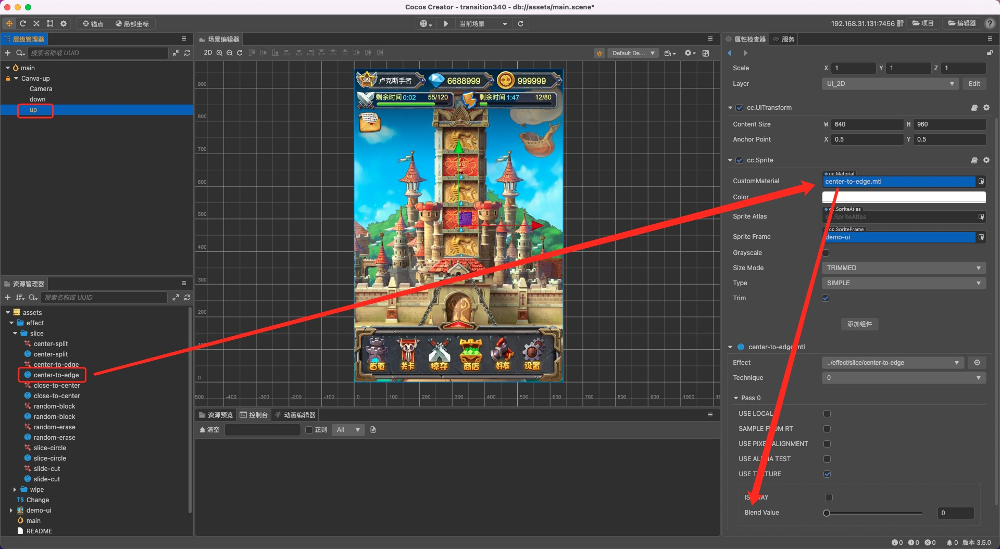
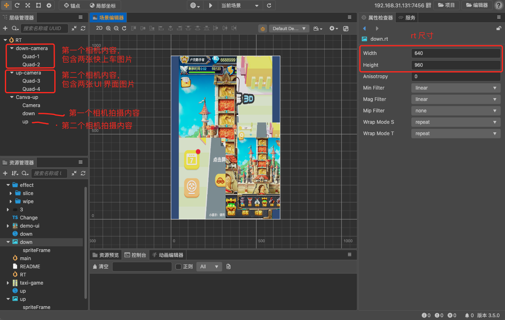
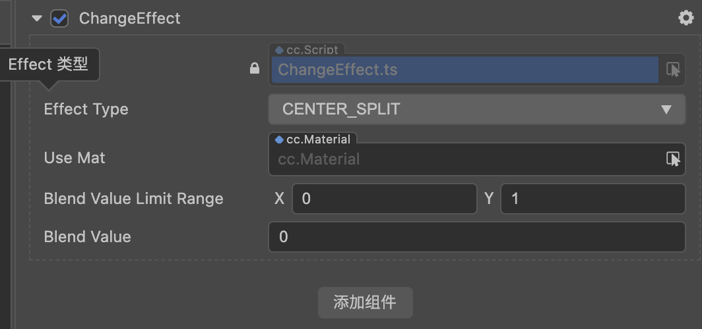
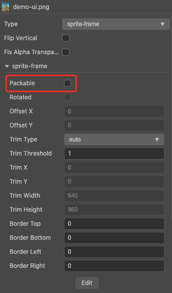

# 多种 PR 转场效果

在 3.5 上复刻了几种网上提供的 pr 转场实现，低版本可直接把文件拷贝过去使用（不要拷贝文件的 meta 文件）。所有 shader 都只能在 2D 上使用。

https://github.com/JoneLau/pr-transitions/blob/master/transitions.mp4

## 使用方式

### 针对单张图片

打开测试场景 **main**，在层级管理器上找到 **up** 节点，查看属性检查器上显示的 **Sprite** 组件，所有的效果都在**资源管理器**下的 effect 文件夹里，找到所需的材质（后缀不带 rt）拖入 **CustomMaterial** 属性里进行替换。操作截图如下：

### 针对一个画面

这里所说的 **一个画面** 是指将相机拍摄到的内容理解为一张图片。打开测试场景 **render-texture**，我在这里新建了两个 3D 相机，分别是 `down-camera` 和 `up-camera`。他们支持渲染的模型分组分别是 `TEX_BOTTOM`、`TEX_UP`（此处可以查看相机的 Visibility 属性），节点只需要将自身的 `Layer` 设置在对应分组下即可（此处可以查看节点的 Layer 属性）。

两个相机拍摄到的画面分别存储在 **资源管理器** 下的 `down.rt`、`up.rt` 里（此处已将 rt 文件放到了相对应相机的 TargetTexture 属性里），可以把 rt 文件理解为照片，照片大小目前设置为 640x960，可自行调整。此时把 rt 文件应用在 2D 精灵的 SpriteFrame 属性上即可看到内容。

找到所需的材质（后缀带 rt）拖入 **CustomMaterial** 属性里进行替换，即可调整转场效果。

### 针对非程序同学

如果想要在多张图片身上使用同一个材质，此处可以使用 **ChangeEffect** 脚本。使用方式：

1. 将脚本放在 main 场景的 up 节点身上，此时会出现如下四个属性，将鼠标移动到属性上，能看到属性描述

    

    - EffectType：特效名
    - UseMat：特效对应材质
    - BlendValueLimitRange：默认过渡调节参数的范围
    - BlendValue：默认过渡调节参数
    - 更多参数会根据不同的特效显示

2. UseMat 材质一定要给，并且同步更新对应的 EffectType

## 所有转场特效

slice 文件夹存放多个分离效果，其中：

- center-split（中心分离）：BlendValue 属性调节分离大小
- center-to-edge（中心拆分）：BlendValue 属性调节拆分大小
- close-to-center（中心合并）：BlendValue 属性调节合并大小
- random-block（随机块状）：BlendValue 属性调节块的离散程度，Width 属性调节块状大小
- random-erase(左右随机块状)：BlendValue 属性调节块的分布区间，Width 属性调节块状大小
- slice-circle(圆形过渡)：BlendValue 属性调节圆形区域，EffectRange 属性调节边缘柔化范围，Invert 属性决定是否需要反向调节显示区域
- slice-cut(切分)：BlendValue 属性调节切分区域移动大小，Hight 属性调节切分区域高度，SliceAngle 属性调节旋转角度

wipe 文件夹存放多个擦除效果，其中：

- bidirectional-clock（双时钟擦除）：BlendValue 属性调节擦除角度，Width 属性调节块状大小
- blinds（不均匀百叶窗）：BlendValue 属性调节擦除程度，Amount 决定百叶窗的分布密度
- blinds1（百叶窗）：BlendValue 属性调节擦除程度，Amount 决定百叶窗的分布密度
- blinds2（百叶窗三角形擦除）：BlendValue 属性调节擦除程度，Amount 决定百叶窗的分布密度
- clock（时钟擦除）：BlendValue 属性调节擦除角度，Width 属性调节块状大小
- rect（方形擦除）：BlendValue 属性调节擦除程度，Amount 决定方块的分布密度
- rhombus-blinds（菱形擦除）：BlendValue 属性调节擦除程度，Amount 决定棱形的分布密度
- rhombus（菱形划变擦除）：BlendValue 属性调节擦除范围，Width 属性调节块状大小

## 注意

1. 所有参与转场过渡的贴图都不能参与合图：

    

2. 如果点选材质出现类似下列错误，可忽略，暂不影响使用：

    - “Sampler binding 'cc_spriteTexture' at set 2 binding 11 index 0 is not bounded”

3. 3.5 版本的 rt 渲染有点问题，画面会出现黑色，可以修改一下 rt 文件，再修改回来，然后重新点击节点就可以看到。
